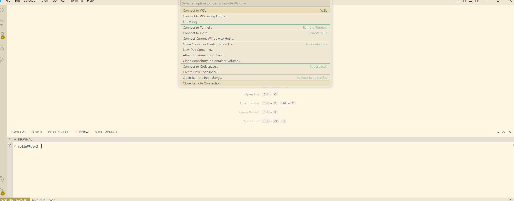

## 1 - WSL et linux

WSL* (Windows Subsystem for Linux) permet de rouler un vrai Linux directement dans Windows, sans machine virtuelle ni dual boot. Tout l'environnement de l'équipe (Docker, ROS 2) roule là-dedans.

*Référence officielle au besoin : <https://learn.microsoft.com/en-us/windows/wsl/install>

### 1.1 - Installer WSL et Ubuntu 22.04

**Ubuntu 22.04.x OBLIGATOIREMENT. Pas « Ubuntu » tout court, pas 24.04.**

Le Microsoft Store n'offre plus la version 22.04 : l'installation se fait donc entièrement par le terminal, pas par le Store.

1. Ouvrir PowerShell en administrateur : clic droit sur le menu Démarrer → Terminal (administrateur).

2. Vérifier que la version 22.04 est offerte :

```powershell
wsl --list --online
```

La liste doit contenir `Ubuntu-22.04` (c'est ce nom exact, avec le tiret, qu'on utilise ensuite).

3. Installer WSL et Ubuntu 22.04 d'un seul coup :

```powershell
wsl --install -d Ubuntu-22.04
```

Cette commande fait tout : elle active les fonctionnalités Windows nécessaires (Virtual Machine Platform et Windows Subsystem for Linux), télécharge le noyau WSL2 et installe Ubuntu 22.04.

4. REBOOT (obligatoire une fois l'installation terminée).

**Si la commande échoue** (fonctionnalités Windows désactivées, vieille installation), les activer manuellement puis réessayer :

```powershell
dism.exe /online /enable-feature /featurename:Microsoft-Windows-Subsystem-Linux /all /norestart
dism.exe /online /enable-feature /featurename:VirtualMachinePlatform /all /norestart
```

Redémarrer, puis :

```powershell
wsl --set-default-version 2
wsl --install -d Ubuntu-22.04
```

### 1.2 - Premier démarrage d'Ubuntu

Après le redémarrage, Ubuntu ouvre un terminal et termine son installation. S'il ne s'ouvre pas tout seul, chercher « Ubuntu 22.04 » dans le menu Démarrer.

Ubuntu demande ensuite de créer un username (en minuscules, sans espaces) et un mot de passe.

*Attention, les caractères d'un mot de passe n'apparaissent pas sur Linux, vous ne verrez aucune notification visuelle que vous entrez des caractères.

Une fois dans le terminal Ubuntu, mettre le système à jour :

```bash
sudo apt update && sudo apt upgrade -y
```

### 1.3 - Vérifications

Dans PowerShell (pas dans Ubuntu) :

```powershell
wsl -l -v
```

Résultat attendu : `Ubuntu-22.04` avec `VERSION 2`.

- Si la version affichée est 1 : `wsl --set-version Ubuntu-22.04 2`
- Si plusieurs distros sont installées, définir 22.04 comme défaut : `wsl --set-default Ubuntu-22.04`

Dans le terminal Ubuntu, vérifier la version exacte :

```bash
lsb_release -a
```

Doit afficher Ubuntu 22.04.x LTS.

### 1.4 - WSL dans VS Code

Installer WSL à partir de l'onglet extension :


Cliquer sur les flèches en bas à gauche → Connect to WSL using Distro… → Ubuntu-22.04 (déjà installé à l'étape 1.1, il apparaît dans la liste) :


VS Code redémarre connecté à Ubuntu : la mention « WSL: Ubuntu-22.04 » apparaît en bas à gauche et le terminal intégré (Terminal → New Terminal) ouvre maintenant un shell Ubuntu.

Ouvrir votre « home » en cliquant sur File → Open Folder → Ok.

Pour sortir de l'environnement Linux, recliquer les flèches en bas → choisir Close Remote Connection :



Pour revenir dans Ubuntu plus tard : les flèches en bas à gauche, ou File → Open Recent (les dossiers WSL y restent listés).

## 2 - Docker 


Objectif :
- Comprendre docker
- Installation de docker sur ubuntu 
- Être capable d'écrire ses propres dockerfiles
- Utiliser des docker compose

Docker lets you package your app with everything it needs — code, libraries, system tools — into a single, portable unit called a container. That container can run anywhere: your laptop, your teammate’s laptop, a server, or the cloud and it’ll work exactly the same.

Why not just install stuff normally?
Because normal setups are messy. One dev has Node.js 16, another has 18, and suddenly something breaks. Docker says, “Let’s put your app in its own bubble so it doesn’t care what’s outside.”

Docker adresse le classic : Moi, ça marche sur ma machine.

Pourquoi c'est important en drone, on utilise souvent des du codes et des environnements partagés par plusieurs développeurs, sur leurs ordis persos, et sur l'ordinateur de zenith. En plus de ça, on doit déployer le code et ses environnement sur des vrais ordinateurs embarqués, qu'ils soient des jetsons ou des raspberry pi. En bref, on a énormément de plateformes différentes à gêrer, et on doit toujours s'assurer que tout le monde reste à jour, peu importe la plateforme.

Certains d'entre vous auront peut-être déjà entendus parler de VM (virtual machine). Un container est similaire, mais est beaucoup plus léger et efficace. 

Docker -> lightweight ninja 
Vm -> Big tanks


Installation de docker :

Adaptée pour Ubuntu 22.04, Ubuntu 24.04, Ubuntu 26.04
Vient du guide officiel :
https://docs.docker.com/engine/install/ubuntu/

Retrait de tous les packaages qui pourrait faire conflit avec les installations suivantes

sudo apt remove $(dpkg --get-selections docker.io docker-compose docker-compose-v2 docker-doc docker-buildx podman-docker containerd runc | cut -f1)

Installation :

# Add Docker's official GPG key:
sudo apt update
sudo apt install ca-certificates curl
sudo install -m 0755 -d /etc/apt/keyrings
sudo curl -fsSL https://download.docker.com/linux/ubuntu/gpg -o /etc/apt/keyrings/docker.asc
sudo chmod a+r /etc/apt/keyrings/docker.asc

# Add the repository to Apt sources:
sudo tee /etc/apt/sources.list.d/docker.sources <<EOF
Types: deb
URIs: https://download.docker.com/linux/ubuntu
Suites: $(. /etc/os-release && echo "${UBUNTU_CODENAME:-$VERSION_CODENAME}")
Components: stable
Architectures: $(dpkg --print-architecture)
Signed-By: /etc/apt/keyrings/docker.asc
EOF

sudo apt update


Installation des packages docker :

sudo apt install docker-ce docker-ce-cli containerd.io docker-buildx-plugin docker-compose-plugin


vérification que docker marche :

sudo docker run hello-world

Cette commande download une petite image test et roule un conteneur, le conteneur devrait juste print un peu d'info comme quoi ça marche et etc. 

# Créer le groupe docker (s'il n'existe pas déjà)
sudo groupadd docker

# Ajouter votre utilisateur au groupe docker
sudo usermod -aG docker $USER

# Redémarrer votre session WSL Ubuntu-22.04

Sortez via les flèches en bas à gauche

wsl --shutdown

Rouvrir wsl

# Répertoire de commandes docker :

docker ps ->
docker stop <container-id> ->
docker rmi <image-id> ->
docker build
docker exec -it <id> bash

# Terminologie

Différence entre images et containers

You hear people say “images” and “containers” like they’re interchangeable. But they’re not the same — and understanding the difference is what takes you from beginner to “I know what I’m doing.”

What’s a Docker Image?
A Docker image is like a recipe or blueprint.
It’s a read-only file that contains everything your app needs — code, runtime, dependencies, environment variables, etc.

You can’t run it directly just like you can’t eat a recipe.
But once you “cook” it into a container, it’s game on.

What’s a Docker Container?
A container is a running instance of an image.
It’s your app, actually alive and doing stuff.

So:

Image = the instructions
Container = the app built and running from those instructions

Real-World Analogy:
Image = the game disc
Container = you playing the game on your console

You can make as many containers as you want from one image, just like you can play the same game on multiple consoles.

# Écriture des dockerfile

En pratique en écrivant les dockerfile, on commencer toujours par une image de base, qui contient les dépendances de base ou le système d'opération qu'on veut utiliser

Adapter ce script pour une version ros2/python, et rouler une mini app python qui roule sur une commande, ainsi qu'une webapp basic sur une autre commande


# Use an existing image as base
FROM rosbase (à corriger)

# TODO : ajouter python basics
# TODO : ajouter mavros

# Set working directory
WORKDIR /app

# Set good permissions
À trouver de AEAC 2026


Example de compose :

'''

'''


