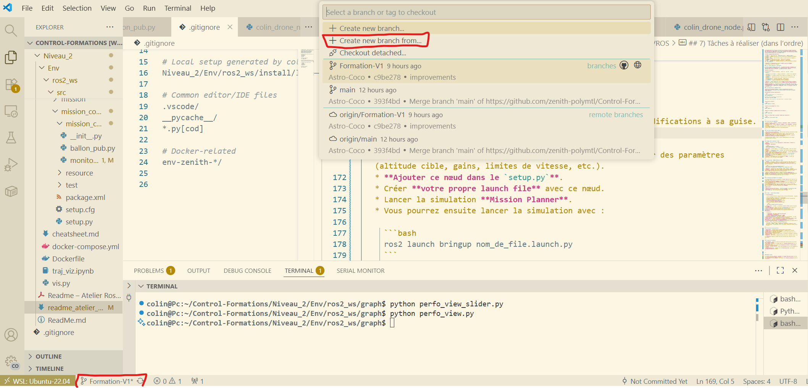

# 🛰️ Atelier Docker / ROS 2 + MAVROS

### Suivi d’une cible mobile (“Ballon”) et évaluation automatique

> **But** — Concevoir un nœud ROS 2 qui suit une cible mobile et démontrer la maîtrise des bases ROS 2 dans un contexte drone, en utilisant **MAVROS** (pont ROS 2 ↔︎ MAVLink) et/ou des abstractions haut-niveau comme **ZenMav**. Le tout est évalué par un **nœud moniteur** fourni.

---

## 1) Docker

**Docker** est une plateforme de virtualisation légère qui permet d’exécuter des applications dans des environnements isolés appelés **conteneurs**. Contrairement aux machines virtuelles, les conteneurs partagent le noyau du système hôte, ce qui les rend **plus rapides au démarrage** et **moins gourmands en ressources**.

Dans le contexte d’un **drone sur ROS 2**, Docker est particulièrement utile pour :

* **Standardiser les environnements de développement et d’exécution** : chaque nœud ROS 2 (navigation, traitement d’image, télémétrie, …) peut tourner dans un conteneur avec ses dépendances exactes, garantissant le même comportement sur un ordinateur, un Jetson, ou une station sol. Une solution finale à : ça marche sur mon ordi (presque).
* **Faciliter le déploiement embarqué** : sur une carte comme le **Jetson Orin NX**, Docker permet d’exécuter plusieurs modules logiciels (ROS 2, MAVROS, vision, IA, etc.) sans interférences ni conflits de versions.
* **Simplifier les tests et la maintenance** : un conteneur peut être mis à jour, redémarré ou remplacé sans perturber le reste du système, ce qui est crucial pour les plateformes embarquées sensibles.

**En somme**, Docker offre un cadre **reproductible**, **modulaire** et **stable** pour le développement, le test et le déploiement d’applications ROS 2 dans les systèmes de drones modernes. 

### 1.1) Dockerfile — description

Un **Dockerfile** est un fichier texte qui décrit **toutes les étapes nécessaires pour construire une image Docker**. Il définit l’environnement logiciel dans lequel votre application va s’exécuter. Chaque ligne correspond à une instruction que Docker exécute séquentiellement pour créer l’image finale.

**Éléments typiques d’un Dockerfile** :

* **`FROM`** : image de base (ex. `FROM ubuntu:22.04` ou `FROM ros:humble`)
* **`RUN`** : commandes exécutées lors de la construction (installation de paquets, dépendances, etc.)
* **`COPY` / `ADD`** : copie de fichiers depuis le projet local vers l’image (ex. code source, scripts)
* **`WORKDIR`** : répertoire de travail à l’intérieur du conteneur
* **`ENV`** : variables d’environnement nécessaires à l’application
* **`CMD` / `ENTRYPOINT`** : commande principale exécutée au démarrage du conteneur (ex. `ros2 launch …`)

> **Résumé** : le **Dockerfile** définit **comment construire l’image** (l’environnement d’exécution complet).

### 1.2) `docker-compose.yml` — description

Le fichier **`docker-compose.yml`** sert à **orchestrer plusieurs conteneurs** et à décrire **comment ils interagissent**. Il permet de définir, dans un seul fichier, l’ensemble des services nécessaires à une application ROS 2 complète.

**Sections courantes** :

* **`services`** : liste des conteneurs à lancer (ex. `ros_core`, `vision`, `telemetry`)

  * **`build`** ou **`image`** : indique le Dockerfile à utiliser ou une image déjà construite
  * **`volumes`** : partage de dossiers entre l’hôte et le conteneur (ex. `/dev`, `/workspace`)
  * **`ports`** : redirection des ports réseau (utile pour la télémétrie ou un dashboard)
  * **`environment`** : variables spécifiques à chaque service
  * **`depends_on`** : ordre de lancement entre les conteneurs
* **`networks`** : canaux de communication entre les conteneurs

> **Résumé** : `docker-compose.yml` décrit **comment exécuter plusieurs conteneurs ensemble**, tandis que le Dockerfile décrit **comment construire chaque conteneur**.

**Exemple drone/ROS 2** : le Dockerfile construit un conteneur ROS 2 avec les bons packages/dépendances, tandis que le `docker-compose.yml` orchestre le système complet : un conteneur pour la communication **MAVLink**, un pour la **vision**, un pour le **contrôle**, etc.

### 1.3) Installation et commandes utiles

**Installation de Docker** (Ubuntu) : suivre la documentation officielle
[https://docs.docker.com/engine/install/ubuntu/](https://docs.docker.com/engine/install/ubuntu/)

**Configuration initiale (permissions)** :

```bash
# Créer le groupe docker (s'il n'existe pas déjà)
sudo groupadd docker

# Ajouter votre utilisateur au groupe docker
sudo usermod -aG docker $USER

# Redémarrer votre session (ex. WSL Ubuntu-22.04 / reconnecter VSCode)
```

**Construire et lancer** :

```bash
docker compose up --build
```

**Lancer un environnement déjà bâti** :

```bash
docker compose up
```

**Fermer les conteneurs (important après une séance)** :

```bash
docker compose down
```

**Ouvrir un terminal dans le conteneur (autant que nécessaire)** :

```bash
docker exec -it env-zenith-1 bash
```

---

## 2) Ce que vous allez apprendre

* Architecture ROS 2 : **nœuds**, **topics**, **messages**, **QoS**, **callbacks**, **timers**, **paramètres**.
* Intégration drone : notions **MAVLink ↔︎ MAVROS**, frames **ENU/NED**, timestamps et horloge.
* Stratégies de suivi de cible simples (poursuite directe, lissage, limites), sans présumer d’une API unique.
* Lecture d’une **note** de performance émise automatiquement.

---

## 3) Les trois fichiers fournis (aperçu)

* **Générateur de cible (“Ballon”)** : publie une pose cible qui évolue dans le temps et signale le début/fin d’une session.
* **Moniteur** : souscrit aux flux pertinents (cible + drone) et calcule des métriques (erreurs, cumulés, résumé). Sort un rapport (p. ex. CSV).
* **Solution d’exemple** : une implémentation minimale de suivi. **À consulter seulement après votre propre tentative (idéalement)**.

> Les noms de topics exacts, frames et détails d’implémentation sont visibles directement dans les fichiers.

---

## 4) Rappels ROS 2 essentiels (rclpy)

* **Nœud** : classe qui crée des **publishers**, **subscribers**, **timers** et **services**.
* **Publisher / Subscriber** :

  ```python
  create_publisher(Type, "…", queue)
  create_subscription(Type, "…", callback, queue)
  ```
* **Callback** : fonction appelée à la réception d’un message ; éviter les calculs bloquants.
* **Timer** : `create_timer(période_s, callback)` pour une boucle d’asservissement périodique (p. ex. 0.02–50 Hz).
* **QoS** : choisir une profondeur raisonnable (KEEP_LAST) ; préférer **Best Effort** pour flux rapides (IMU) et **Reliable** pour états lents. 
Voir :
https://docs.ros.org/en/humble/Concepts/Intermediate/About-Quality-of-Service-Settings.html

  ```python
    from rclpy.qos import (
        QoSProfile, QoSHistoryPolicy, QoSReliabilityPolicy, QoSDurabilityPolicy,
        qos_profile_sensor_data
    )
    ```
    Dans init :

        reliable_qos = QoSProfile(
                history=QoSHistoryPolicy.KEEP_LAST, depth=10,
                reliability=QoSReliabilityPolicy.RELIABLE,
                durability=QoSDurabilityPolicy.VOLATILE
            )

        self.pub_cmd = self.create_publisher(PoseStamped, '/cmd_target', reliable_qos)

* **Paramètres** : exposer des gains/vitesses/altitudes via `declare_parameter` / `get_parameter` pour itérer sans recompiler.
* **Horodatage** : utiliser les timestamps des messages (et le `dt`) pour la cohérence temporelle.
* **Frames** : côté MAVROS, ROS 2 est généralement en **ENU** ; vérifier les conversions si votre contrôleur attend **NED**.

---

## 5) Couches drone : MAVROS, MAVLink et ZenMav

* **MAVROS** : pont ROS 2 ↔︎ MAVLink. Il expose la télémétrie (pose, IMU, état) et des interfaces de commande (positions/vitesses/attitude) sous forme de topics/services/actions ROS 2. *N’expose pas les messages de télémétrie par défaut.* Pour avoir la télémétrie :

  ```bash
  ros2 service call /mavros/set_message_interval \
  mavros_msgs/srv/MessageInterval "{message_id: 32, message_rate: 20.0}"
  ```
* **MAVLink** : protocole bas niveau (messages, modes, armement, consignes).
* **ZenMav** : **option** haut-niveau (Python) qui encapsule des séquences courantes (mode/armement/consignes). Vous pouvez **tout** faire avec MAVROS seul, **ou** utiliser ZenMav pour simplifier — au choix du participant.

> L’atelier **n’impose pas** d’API de commande. Choisissez **MAVROS pur** ou **ZenMav** selon vos préférences et la situation. **Toutefois**, plusieurs fonctions de ZenMav sont **bloquantes**, et devront être évitées afin de ne pas bloquer la réception et l’envoi de messages d’un nœud (selon le contexte).

---

## 6) Architecture de l’atelier (vue logique)

1. Un nœud **Ballon** publie périodiquement une *pose cible* dans une frame fixe (ex. `map`, ENU).
2. Votre nœud **Participant** souscrit cette pose et génère des commandes de guidage (position/vitesse/yaw…) via **MAVROS** ou **ZenMav**.
3. Un nœud **Moniteur** observe cible et drone, puis calcule une **note** sur une fenêtre temporelle définie.
4. La simulation peut se passer dans le simulateur désiré, mais les simulations intégrées d’**ArduPilot** dans **Mission Planner (MP)** sont proposées ici (comme vu dans la formation 1). Peut aussi fonctionner avec **Gazebo**.

**Rappel (MP)** :

* **Ports de simulation par défaut** : `tcp:127.0.0.1:5762` et `tcp:127.0.0.1:5763`
* **Attention** : un de ces ports est utilisé par **MAVROS**, lancé via `docker-compose.yml`. Voir ce fichier pour identifier lequel.

---

## 7) Tâches à réaliser (dans l’ordre)

0. **Initialisation** :

    * Créer sa propre branche du repo pour pouvoir faire des modifications à sa guise.
    
    - Être collaborateur du git hub (envoyer votre nom git sur discord et on vous ajoutera)
    - Cliquer sur la branche active en bas à gauche. 
    - Créer une nouvelle branche à partir de main
    - Publier votre branche à partir du source control 
    * Garder votre branche à jour (commit/push)! Ne modifiez pas les fichiers existants, créer les votres! 

   * Créer un nœud ROS 2 (rclpy) ou c++ si vous voulez.
   * Configurer publishers/subscribers ; éventuellement déclarer des paramètres pour rendre votre projet modulaire.
   * **Ajouter ce nœud dans le `setup.py`**.
   * Créer **votre propre launch file** avec ce nœud.
    - Vous pouvez vous inspirez de la launch file d'exemple dans bringup
   * Lancer la simulation **Mission Planner**.
   * Vous pourrez ensuite lancer la simulation avec :

     ```bash
     ros2 launch bringup nom_de_file.launch.py
     ```
1. **Rendez-vous** : se rendre à la coordonnée **(10, 20, -50)**, donnée en système local **NED**.
2. **Annonce d’amorce** : publier votre nom (`std_msgs/String`) sur le topic **`/arrival`**. Un décompte commencera peu après pour le début du défi.
3. **Suivi de cible** : la position d’un ballon virtuel est publiée sur **`/Ballon_pose`**. Votre objectif est d’être le plus proche de ce point **à sa publication**.

   * Trajectoire :

     * **Continue**, mais publiée **de façon discrète**
     * **Réaliste** / **réalisable**
     * **Théoriquement parfaite** (sans bruit rapide)
   * Messages : `geometry_msgs/PoseStamped`, **ENU**.
4. **Être proche du ballon** : vous serez **évalué** sur votre distance à la cible **toutes les 0.5 s**, sans connaissance future de la trajectoire.
5. **RTL à la fin** : après **2 minutes**, les points cessent d’être publiés **sans avertissement**. À ce moment, le drone doit **retourner au décollage pour y atterrir**. La fin doit être **détectée automatiquement**.
6. **Évaluation de performance** : un **CSV** de vos performances est produit dans le répertoire `ros2_ws` sous le nom **`pose_distances.csv`**.

   * Un fichier Python permet de visualiser la performance.
   * Nécessite : `pandas`, `numpy`, `matplotlib` (installation standard via `pip` dans le terminal). Personellement utilisé hors-docker, matplotlib rarement utilisé in-docker. 

   Une stratégie de poursuite pure donnera un score d'environ 1400. Considérez donc un score de 1300 et moins comme une réussite de l'atelier, ce qui signigie que vous avez implémentez une loi de contrôle X pour optimiser la performance. Un score parfait est de 0 (Impossible).

---

## 8) Critères de réussite (général)

* **Exactitude** : distance moyenne au ballon faible, dérive limitée.
* **Stabilité** : pas d’oscillations persistantes, commande bornée (vitesses/altitudes limitées), continuité des consignes.
* **Robustesse** : comportement raisonnable si la cible saute/ralentit/accélère ; gestion de messages manquants ponctuels.
* **Qualité ROS 2** : structure claire (timers vs callbacks), QoS adaptés, paramètres configurables, logs utiles.
* **Hygiène** : code lisible, commentaires brefs mais précis, séparation calcul / I/O.

> Le **Moniteur** exporte un rapport que vous utiliserez pour interpréter votre performance.

---

## 9) Conseils de conception

* **Découplage** : stocker les dernières mesures dans l’état du nœud et les traiter dans la boucle **timer**.
* **Filtrage** : appliquer un lissage simple (ex. **moyenne exponentielle**) sur la cible si nécessaire.
* **Limites** : imposer des plafonds de **vitesse/accélération** et d’**altitude** ; prévoir une **zone de sécurité**.
* **Temps** : calculer **`dt`** (à partir des horodatages) pour les lois dépendant de la vitesse.
* **Essais progressifs** : commencer par une **poursuite naïve**, puis ajouter **lissage/anticipation** au besoin.

---


---


### Remarque finale

* Le détail exact des **topics**, **frames** et **signaux d’orchestration** est dans les **fichiers fournis** (Ballon, Moniteur).
* La **solution** est un *exemple* ; privilégier votre **propre conception** avant de la consulter.
